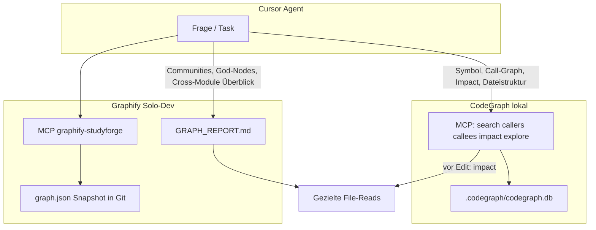

# CodeGraph neben Graphify integrieren

## Ist-Zustand (Recherche)

| Prüfung | Ergebnis |
|---------|----------|
| `codegraph` CLI | **Erledigt** — v0.9.3, `/home/pc/.local/bin/codegraph` (install.sh + `npm i -g`; beides OK, MCP nutzt `command: "codegraph"`) |
| [`.codegraph/`](.codegraph/) im Repo | **Lokal** (gitignored; `codegraph init -i` nach Clone) |
| Repo-Referenzen zu `codegraph` | **Erledigt** — Rules, MCP-Templates, `docs/CODEGRAPH.md`, npm scripts |
| Graphify | **Aktiv**: [`graphify-out/GRAPH_REPORT.md`](graphify-out/GRAPH_REPORT.md), [`npm run graphify:refresh`](package.json), MCP [`graphify-studyforge`](.cursor/mcp.json) via [`scripts/graphify-mcp-serve.sh`](scripts/graphify-mcp-serve.sh) |
| Cursor Rules | [`105-graphify-solo-dev.mdc`](.cursor/rules/105-graphify-solo-dev.mdc), [`850-mcp-and-prd.mdc`](.cursor/rules/850-mcp-and-prd.mdc), [`index.mdc`](.cursor/index.mdc) |
| MCP-Templates | [`.mcp.example.json`](.mcp.example.json) (codegraph + graphify); [`.mcp.example.full.json`](.mcp.example.full.json) (+ optional `code-review-graph`) |
| Gitignore | [`.gitignore`](.gitignore) — `.codegraph/`, Graphify-Cache, `.cursor/mcp.json` |



---

## Schritt 1 — Installation (CLI + PATH) — erledigt

Du hast bereits installiert:

- `install.sh` → `/home/pc/.codegraph/versions/v0.9.3`, Symlink `/home/pc/.local/bin/codegraph`
- `npm install -g @colbymchenry/codegraph` → ebenfalls v0.9.3

Verifikation (bereits OK): `codegraph --version` → `0.9.3`, `which codegraph` → `~/.local/bin/codegraph`.

**Kein weiterer Install-Schritt nötig.** Doppel-Install ist unkritisch; für MCP reicht der PATH-Eintrag unter `~/.local/bin`. Bei der Umsetzung **Schritt 2 direkt** starten.

---

## Schritt 2 — Cursor konfigurieren (`codegraph install`)

Vor dem Install **bestehende MCP-Config sichern** (`.cursor/mcp.json` ist gitignored, enthält aktuell nur Graphify):

```bash
cp .cursor/mcp.json .cursor/mcp.json.bak 2>/dev/null || true
```

**Nicht-interaktiv** (projektlokal, nur Cursor):

```bash
cd /home/pc/githubcursor/StudyForge
codegraph install --target=cursor --location=local --yes
```

Das schreibt typischerweise:
- MCP-Snippet für Cursor (projektlokal oder global — je nach Installer)
- Basis-Rule [`.cursor/rules/codegraph.mdc`](.cursor/rules/codegraph.mdc) (upstream-Template)

**Danach manuell mergen**: Graphify-Eintrag darf nicht verloren gehen. Ziel-MCP (committed als Template in [`.mcp.example.json`](.mcp.example.json)):

```json
{
  "mcpServers": {
    "graphify-studyforge": {
      "command": "bash",
      "args": ["scripts/graphify-mcp-serve.sh"],
      "type": "stdio"
    },
    "codegraph": {
      "type": "stdio",
      "command": "codegraph",
      "args": ["serve", "--mcp"]
    }
  }
}
```

Anwenden:

```bash
cp .mcp.example.json .cursor/mcp.json   # nach Aktualisierung der Example-Datei
```

Cursor: **Settings → MCP → beide Server aktivieren → Fenster neu laden**.

Optional High-End-Profil: gleichen `codegraph`-Block in [`.mcp.example.full.json`](.mcp.example.full.json) ergänzen (neben `code-review-graph`).

---

## Schritt 3 — Projekt indexieren

```bash
cd /home/pc/githubcursor/StudyForge
codegraph init -i
```

- Erzeugt `.codegraph/` (SQLite + Metadaten)
- Baut den vollständigen Index (`-i`)
- Legt/aktualisiert projektlokale Agent-Surfaces (u.a. `codegraph.mdc`)

**Git-Policy**: `.codegraph/` **nicht committen** (lokal wie `node_modules`, regenerierbar). In [`.gitignore`](.gitignore) ergänzen:

```
.codegraph/
```

StudyForge bleibt bei Graphify-Snapshot-Policy: weiterhin nur [`graphify-out/graph.json`](graphify-out/graph.json) + [`GRAPH_REPORT.md`](graphify-out/GRAPH_REPORT.md) in Git.

**Low-End-Hinweis** (konsistent mit [`105-graphify-solo-dev.mdc`](.cursor/rules/105-graphify-solo-dev.mdc)):
- Initial-Index nicht parallel zu `npm run dev` / `graphify:refresh` auf <8GB RAM
- CodeGraph auto-sync per File-Watcher ist OK; kein zweites `graphify watch` nötig
- Nach großen Refactors: `codegraph sync` (falls MCP-Symbole fehlen) + `npm run graphify:refresh` vor Push

---

## Schritt 4 — Cursor Rule: Dual-Tool-Policy

Neue/erweiterte Datei: [`.cursor/rules/codegraph.mdc`](.cursor/rules/codegraph.mdc)

**Kerninhalt** (StudyForge-spezifisch, über upstream-Template hinaus):

| Situation | Primär | Sekundär |
|-----------|--------|----------|
| Symbol finden, Caller/Callee, Impact vor Refactor | **CodeGraph MCP** (`codegraph_search`, `codegraph_callers`, `codegraph_callees`, `codegraph_impact`, `codegraph_node`) | — |
| „Wie funktioniert System X?“ (mehrere Dateien) | **CodeGraph** `codegraph_explore` / `codegraph_context` (große Payloads — budgetiert nutzen) | Graphify query mit `--budget` |
| Architektur-Überblick, Communities, God-Nodes | **Graphify** [`GRAPH_REPORT.md`](graphify-out/GRAPH_REPORT.md) | `codegraph_files` für Index-Struktur |
| Cross-Modul „wie hängt A mit B zusammen?“ | Graphify `graphify query` / MCP | CodeGraph für konkrete Symbole entlang des Pfads |
| Docs/ADR/PRD, nicht-Code | Normale Reads [`docs/`](docs/) | Graphify |
| Breites `grep` über ganzes Repo | **Letzter Ausweg** | — |

**Agent-Navigationsreihenfolge** (ersetzt/ergänzt Punkt 4 in `105-graphify-solo-dev.mdc`):

1. `codegraph_status` — Index vorhanden?
2. CodeGraph MCP für strukturelle Fragen
3. `graphify-out/GRAPH_REPORT.md` für Makro-Architektur
4. Graphify MCP / `npm run graphify:query`
5. Gezielte `@src/...` Reads
6. `grep` nur als Fallback

`alwaysApply: true` oder `description` mit klarer Trigger-Phrase — damit Cursor die Rule zuverlässig lädt (analog zu Manifest in [`index.mdc`](.cursor/index.mdc)).

---

## Schritt 5 — Kurztest der Integration

```bash
codegraph status .
codegraph query rag --limit 5
codegraph callers queryRAGHybrid --limit 5   # Beispiel-Symbol anpassen falls nicht indexiert
```

MCP-Smoke (optional):

```bash
codegraph serve --mcp   # sollte stdio starten; mit Ctrl+C beenden
```

In Cursor: neue Agent-Session, MCP-Tools sichtbar, Testfrage: *„Wer ruft `queryRAGHybrid` auf?“* — erwartet CodeGraph-Antwort ohne Repo-weites Grep.

Graphify parallel prüfen:

```bash
npm run graphify:refresh
# MCP graphify-studyforge weiterhin erreichbar
```

---

## Schritt 6 — Repo-weite Rules/Docs aktualisieren

| Datei | Änderung |
|-------|----------|
| [`.gitignore`](.gitignore) | `.codegraph/` |
| [`.mcp.example.json`](.mcp.example.json) | `codegraph` MCP-Server |
| [`.mcp.example.full.json`](.mcp.example.full.json) | ebenfalls `codegraph` |
| [`.cursor/rules/105-graphify-solo-dev.mdc`](.cursor/rules/105-graphify-solo-dev.mdc) | Abschnitt „Complement with CodeGraph“, aktualisierte Navigationsreihenfolge |
| [`.cursor/index.mdc`](.cursor/index.mdc) | Agent Conventions: CodeGraph + Graphify |
| [`.cursor/rules/850-mcp-and-prd.mdc`](.cursor/rules/850-mcp-and-prd.mdc) | MCP-Tabelle: `codegraph` Server |
| [`docs/CODEGRAPH.md`](docs/CODEGRAPH.md) | **Neu**: Install, init, sync, Dual-Workflow, Troubleshooting |
| [`docs/GRAPHIFY.md`](docs/GRAPHIFY.md) | Verweis auf `docs/CODEGRAPH.md` |
| [`CONTRIBUTING.md`](CONTRIBUTING.md) | Setup-Schritte für neue Contributor |
| [`package.json`](package.json) | Optional: `"codegraph:init": "codegraph init -i"`, `"codegraph:status": "codegraph status ."` |

**Optional außerhalb Repo**: [`/home/pc/CLAUDE.md`](/home/pc/CLAUDE.md) um CodeGraph-Zeile ergänzen (global für Claude Code; StudyForge-Details bleiben in `.cursor/rules/`).

Nach Code-Änderungen in der Session (bestehende Policy): `graphify update .` bzw. `npm run graphify:refresh` — CodeGraph synct automatisch; bei Bedarf `codegraph sync`.

---

## Zusammenfassung für dich (nach Umsetzung)

**Was gemacht wurde** (nach Bestätigung dieses Plans):
- CodeGraph CLI installiert, Cursor per `install` + MCP-Merge mit Graphify verdrahtet
- Vollindex unter `.codegraph/` (lokal, gitignored)
- Agent-Rule + Docs beschreiben wann welches Tool
- Templates `.mcp.example*.json` für Reproduzierbarkeit

**Manuelle Commands zum Wiederholen**:

```bash
# Einmalig / neuer Rechner (bei dir bereits erledigt)
# curl -fsSL .../install.sh | sh   # oder: npm i -g @colbymchenry/codegraph
codegraph install --target=cursor --location=local --yes

# Pro Projekt / nach Clone
cd StudyForge
codegraph init -i
cp .mcp.example.json .cursor/mcp.json   # wenn MCP fehlt
npm run graphify:refresh                 # Graphify-Snapshot

# Wartung
codegraph status .
codegraph sync .                         # bei fehlenden Symbolen
npm run graphify:refresh                 # vor Push bei src/lib/workers-Änderungen
```

**Best Practice: Beide Tools**

- **CodeGraph zuerst** bei Code-Struktur: Suche, Call-Graph, Impact, indexierte Dateibaum — wenige MCP-Calls, wenig Token.
- **Graphify** für den **breiten Architektur-Überblick** (Communities, God-Nodes, cross-module Graph-Queries) und den **geteilten Git-Snapshot** fürs Team.
- **Kombination**: Graphify → „wo im System?“; CodeGraph → „welche Symbole/Calls genau?“; dann gezielte Edits; vor PR Graphify-Refresh + `codegraph sync` bei Bedarf.

**Risiken / Fallstricke**:
- `codegraph install` kann `.cursor/mcp.json` überschreiben → Backup + Merge mit `graphify-studyforge`
- `.codegraph/` nicht committen (Größe, Maschinen-spezifisch)
- Auf WSL2 `/mnt/c/...` ggf. SQLite-WAL-Probleme → Projekt auf Linux-Dateisystem halten
